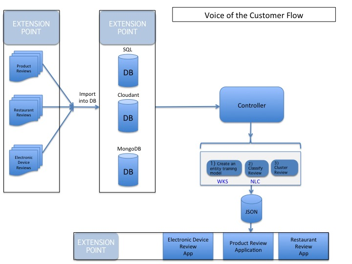

# Voice of the Customer [](https://travis.innovate.ibm.com/watson-developer-cloud/product-intelligence)


This is a Starter Kit (SK), which is designed to get you up and running quickly with a common industry pattern, and to provide information and best practices around Watson services. This application was created to demonstrate how the services can be used to detect sentiment and customer's satisfaction based on different product reviews. This demo for this SK uses reviews from Amazon around products from the Electronics section.

Demo: https://product-intel-demo.mybluemix.net/

**IMPORTANT NOTES:**
1. Using the Watson Knowledge Studio tool requires signing up for it. A 30-day free trial is also available. Go to [WKS](https://www.ibm.com/marketplace/cloud/supervised-machine-learning/us/en-us) to learn more.

2. This application requires an AlchemyAPI key with high transaction limits. The free AlchemyAPI key that you request has a limit of 1000 transactions per day, which is insufficient for significant use of this sample application.  You can upgrade to the Standard or Advanced Plan of the AlchemyAPI service to obtain a key that supports > 1000 transactions per day. Go [here](https://console.ng.bluemix.net/catalog/services/alchemyapi/).

3. The Natural Language Classifier service requires training prior to running the application. Refer to the Training notebook in /notebooks.

## Table of Contents
 - [How this app works](#how-this-app-works)
 - [Getting Started](#getting-started)
 - [Training an entity detection model and a classifier](#training)
 - [Processing the data](#processing)
 - [Running the application locally](#running-locally)
 - [Adapting/Extending the Starter Kit](#adaptingextending-the-starter-kit)
 - [Best Practices](#best-practices)
 - [Troubleshooting](#troubleshooting)

## How this app works
This starter kit uses Jupyter Notebook(s), a web application that allows you to create and share documents that contain code, visualizations and explanatory text.  (Jupyter Notebook was formerly known as iPython Notebook.) Jupyter Notebook automatically executes specific sections of Python code that are embedded in a notebook, displaying the results of those commands in a highlighted section below each block code block.  The Jupyter notebooks in this SK show you how to creating an entity model, classifying and clustering the data.

This SK has 2 primary notebooks:
* Two Jupyter notebooks:
   - `Training`, which shows how to take a data set, import it into Cloudant, create Ground Truth, and use WKS to create an entity model, and then train a classifier.
   - `WKS` which runs on all of the review data once the models are all trained and validated.


## Getting Started

The application is written in [Python](https://www.python.org/doc/). Instructions for downloading and installing it are included in the documentation.

### Prerequisites

You will need the following in order to use this SK:
* A Unix-based OS (or CYGwin)
* Git
* python
* Anaconda - installing this package also installs the Jupyter notebook package, which includes iPython (now referred to jupyter)
* a Bluemix Account

## Installation
1. Log into GitHub and fork the project repository. Clone your fork to a folder on your local system and change to that folder.
2. Create a Bluemix Account. [Sign up][sign_up] in Bluemix, or use an existing account. Watson Beta or Experimental Services are free to use.
3. If it is not already installed on your system, download and install the [Cloud-foundry CLI][cloud_foundry] tool.
4. Edit the `manifest.yml` file in the folder that contains your fork and replace `application-name` with a unique name for your copy of the application. The name that you specify determines the application's URL, such as `application-name.mybluemix.net`. The relevant portion of the `manifest.yml` file looks like the following:

      ```yaml
      declared-services:
        natural-language-classifier-service:
          label: natural_language_classifier
          plan: standard
        cloudantNoSQLDB-service:
          label: cloudantNoSQLDB
          plan: Shared
      applications:
      - services:
         - natural-language-classifier-service
         - cloudantNoSQLDB-service
        name: product-intel-demo
        command: python server.py
        path: .
        memory: 512M
      ```

5. Install the python dependencies with `pip`

    ```sh
    pip install -r requirements.txt
    ```

6. Connect to Bluemix by running the following commands in a terminal window:

    ```bash
    cf api https://api.ng.bluemix.net
    cf login -u <your-Bluemix-ID> -p <your-Bluemix-password>
    ```

7. Create and retrieve service keys to access the [Natural Language Classifier][natural-language-classifier] service by running the following commands:
  ```
  cf create-service natural_language_classifier standard natural-language-classifier-service
  cf service-key natural-language-classifier-service myKey
  ```
  **Note:** You will see a message that states "Attention: The plan standard of `service natural_language_classifier` is not free. The instance classifier-service will incur a cost. Contact your administrator if you think this is in error.". The first Natural Language Classifier instance that you create is free under the standard plan, so there will be no change if you only create a single classifier instance for use by this application
8. Create and retrieve service keys for the Alchemy Language service. If you are using an existing alchemy service, use those credentials instead.

    ```bash
    cf create-service-key alchemy-language-service myKey
    cf service-key alchemy-language-service myKey
    ```

9. Create and retrieve service keys for the Cloudant service. If you are using an existing Cloudant service, use those credentials instead.

    ```bash
    cf create-service-key cloudantNoSQLDB-service myKey
    cf service-key cloudantNoSQLDB-service myKey
    ```

10. Provide the credentials to the application by creating a `.env` file using this format: (**Note**: there is an example .env.example file in the root directory of your forked code instance)

    ```none
    [CLOUDANT]
    CLOUDANT_USERNAME=
    CLOUDANT_PASSWORD=
    CLOUDANT_URL=
    CLOUDANT_DB=voc_ask_db

    [NLC]
    NLC_URL=https://gateway.watsonplatform.net/natural-language-classifier/api
    NLC_USERNAME=
    NLC_PASSWORD=
    NLC_CLASSIFIER=

    [ALCHEMY]
    ALCHEMY_API_KEY=

    [WKS]
    WKS_MODEL_ID=
    ```

## Running locally
First, make sure that you followed steps 1 through 10 in [Getting Started](#Getting Started).

Start the application:

      `python server.py`


## Running the notebooks
The Jupyter notebooks show you  step-by-step instructions, automatically executing specified sections of Python code. We used Jupyter notebooks because they encourage experimentation, which is an important part of developing any machine learning system.

To start the notebooks, make sure you are in the root directory of your git checkout of the SK repository, and execute the command `jupyter notebook`.  This will start the Jupyter notebook server, and open a browser window. Once the browser window is open, click on notebooks, and then open the notebook labeled `training`. Follow the instructions.

## Training an entity detection model

The Training phase is responsible for creating a customized model which detects entities related to the topic of the reviews. This model can be created by using Watson Knowledge Studio (WKS) for annotating the data (product reviews) to detect entities and their relationships.

The WKS tool exports an Alchemy customized model that is then able to extract entities and relationships from unseen data. The steps to preprocess the data and create the models are detailed in the iPython notebooks under the `notebooks` folder of this repo.

To create your WKS model and export it to your Alchemy API key, follow the instructions on the `WKS` notebook.

After you have created your customized model, follow the instructions to train your classifier in the `Training` notebook.


## Processing the data

This step uses the models  trained on the previous step. Follow the instructions on the `WKS` notebook to allow the data to be in a format that can be consumed by the UI.

## Adapting/Extending the Starter Kit

<a>
# Architecture Diagram
</a>



This Starter Kit works off of product reviews data gathered from Amazon product reviews (http://jmcauley.ucsd.edu/data/amazon/). However, the concepts used here are platform independent and can be applied to a use case other than Electronic products reviews. Just define your use case and make sure you train your Natural Language Classifier accordingly by using the tool provided on the service page. Additionally, you can also create your own customized models for entity extraction by using Watson Knowledge Studio and Alchemy.

## Deploying it to Bluemix

Push the updated application live by running the following command:

    ```bash
    cf push
    ```
    or by pressing the "Deploy to Bluemix" button below.

    [](https://bluemix.net/deploy?repository=https://github.com/watson-developer-cloud/product-intelligence.git)

## Reference information

The following links provide more information about the Natural Language Classifier, Cloudant, and Alchemy Language services.

### Natural Language Classifier service
  * [API documentation](http://www.ibm.com/smarterplanet/us/en/ibmwatson/developercloud/doc/nl-classifier/): Get an in-depth knowledge of the Natural Language Classifier service
  * [API reference](http://www.ibm.com/smarterplanet/us/en/ibmwatson/developercloud/natural-language-classifier/api/v1/): SDK code examples and reference
  * [API Explorer](https://watson-api-explorer.mybluemix.net/apis/natural-language-classifier-v1): Try out the API
  * [Creating your own classifier](http://www.ibm.com/smarterplanet/us/en/ibmwatson/developercloud/doc/nl-classifier/get_start.shtml): How to use the API to create and use your own classifier

### Cloudant service
  * [API documentation](https://console.ng.bluemix.net/docs/services/Cloudant/index.html#Cloudant): Get an in-depth understanding of the Cloudant services
  * [API reference](https://docs.cloudant.com/api.html#-api-reference): Code examples and reference

### AlchemyAPI
  * [API documentation](http://www.alchemyapi.com/api): Get an in-depth understanding of the AlchemyAPI services
  * [AlchemyData News reference](http://docs.alchemyapi.com/): API and query gallery

## Best Practices

### Intents for the NLC service instance
  * When defining intents, follow naming conventions to create consistent intents.
  * Use "-" to separate multiple levels (Example : location-weather-forecast)
  * Use "\_" to separate multiple word intents (Example : business_center)
  * Provide more variations of input via examples for each intent. The more variations the better.
  * Avoid overlapping intents across examples. (Example : benefits_eligibility and benefits_elgibility_employee). To avoid this, group examples into a single intent and use entities to deal with subtle variations.
  * Examples for intents should be representative of end user input

### Watson Knowledge Studio (WKS)
  * Entity and Relation Types can NOT have spaces ==> it is best to stick with alphanumeric characters and underscore char.
  * At least 2 entity types and at least 2 relation types with 2 example mentions of each in the ground truth are required to perform a successful training run of machine learning annotator.
  * Rule of thumb: 50 mentions for a given type (entity type, relation type) in the training data. It is recommended to have training data distributed across all possible subtypes and roles for entities to help train system better.
  * When defining type system and document size, make sure that type system is not too complex and document size is not too large that human annotators won't be able to efficiently follow the guidelines. Keep the entity types to less than 50 and keep document size to no more than a few paragraphs.
  * Name entity and relation types in a way that is not ambiguous. If any names for entity or relation types are similar, it will make it more difficult to remember when to use which type.
  * For ground truth, it is recommended to use representative documents that include the entities and relations most relevant for your application. Representative really means that the mentions and relations appear in similar context (other words around them) as to what your application expects.

## Troubleshooting

To troubleshoot your Bluemix application, use the logs. To see the logs, run:

  ```bash
  cf logs <application-name> --recent
  ```

## License

  This sample code is licensed under Apache 2.0. Full license text is available in [LICENSE](LICENSE).

## Contributing

  See [CONTRIBUTING](CONTRIBUTING.md).

## Open Source @ IBM

  Find more open source projects on the [IBM Github Page](http://ibm.github.io/)

### Privacy Notice

This node sample web application includes code to track deployments to Bluemix and other Cloud Foundry platforms. The following information is sent to a Deployment Tracker service on each deployment:

* Application Name (`application_name`)
* Space ID (`space_id`)
* Application Version (`application_version`)
* Application URIs (`application_uris`)

This data is collected from the `VCAP_APPLICATION` environment variable in IBM Bluemix and other Cloud Foundry platforms. This data is used by IBM to track metrics around deployments of sample applications to IBM Bluemix. Only deployments of sample applications that include code to ping the Deployment Tracker service will be tracked.

### Disabling Deployment Tracking

Deployment tracking can be disabled by removing `require('cf-deployment-tracker-client').track();` from the beginning of the `server.py` file at the root of this repo.

### Privacy Notice

This sample web application includes code to track deployments to Bluemix and other Cloud Foundry platforms. The following information is sent to a [Deployment Tracker][deploy_track_url] service on each deployment:

* Application Name (`application_name`)
* Space ID (`space_id`)
* Application Version (`application_version`)
* Application URIs (`application_uris`)

This data is collected from the `VCAP_APPLICATION` environment variable in IBM Bluemix and other Cloud Foundry platforms. This data is used by IBM to track metrics around deployments of sample applications to IBM Bluemix. Only deployments of sample applications that include code to ping the Deployment Tracker service will be tracked.

[deploy_track_url]: https://github.com/cloudant-labs/deployment-tracker
[cloud_foundry]: https://github.com/cloudfoundry/cli
[sign_up]: https://console.ng.bluemix.net/registration/
[get-alchemyapi-key]: https://console.ng.bluemix.net/catalog/services/alchemyapi/

[natural-language-classifier]: http://www.ibm.com/smarterplanet/us/en/ibmwatson/developercloud/nl-classifier.html
[alchemy-language]: http://www.ibm.com/smarterplanet/us/en/ibmwatson/developercloud/alchemy-language.html
[cloudantNoSQLDB]: https://console.ng.bluemix.net/docs/services/Cloudant/index.html#Cloudant
